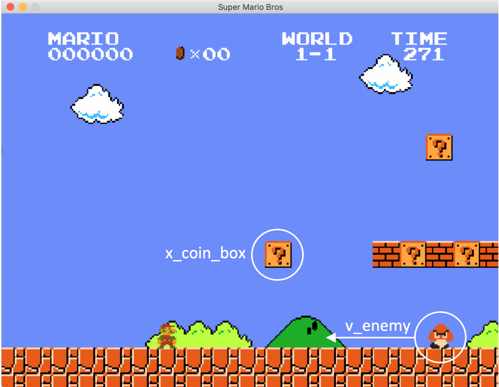
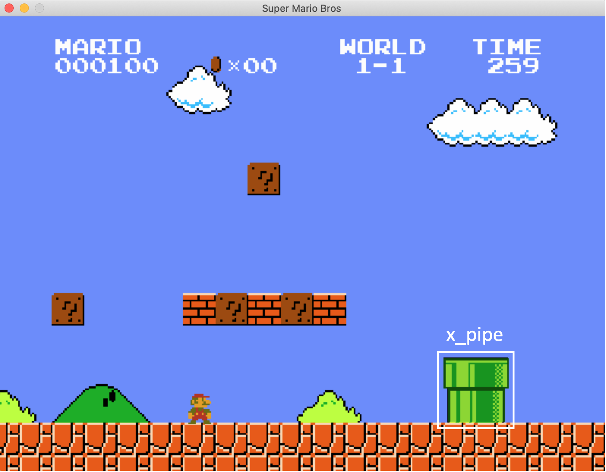

# Super Mario Reference Experiments for Communicating Agents
## Communicating agents

The idea is to use the super Mario game to generate data for a communicating agent problem as described in the paper in H. Poulsen Nautrup, T. Metger, R. Iten, S. Jerbi, L.M. Trenkwalder, H.Wilming, H.J. Briegel, and R. Renner. "Operationally meaningful representations of physical systems in neural networks" (2020).

The code for the Mario game is based on https://github.com/marblexu/PythonSuperMario.git and modified for our purposes. --> Thanks a lot marblexu!

### Hidden states:
  1. Position of coin ($x_{coin}$) 
  1. Speed of first enemy ($v_{enemy}$)
  2. Position of first pipe ($x_{pipe}$)

### Reference experiment
  - Start game with randomly selected values for hidden states  
  - Let Mario run (walk) at normal speed
  - Observations:
    - Some number of pictures of the game taken at equal $\Delta t$ 

### Questions
Given Mario's constant running speed (as question input), at what point in time does Mario need to jump in order to:
  - Kill the enemy?
  - Get the coin from the first question mark?
  - Overcome the pipe?

### Neural net implementation
#### Encoding agents
In this scenario we need one decoding agents ($E$).
This Agent ($E$) receives a fixed number of images (a sequence of image/ video) of the game with an unknown experimental (values of the hidden states) setting as input.
The output dimension of $E$ equals the number of hidden states (in this case 3)

#### Filter
The filter function passes the activation of E's output nodes on to three decoding agents $D_1$ to $D_3$.
However for each output node the filter function adds a bias term times some gaussian error. 

#### Decoding agents

